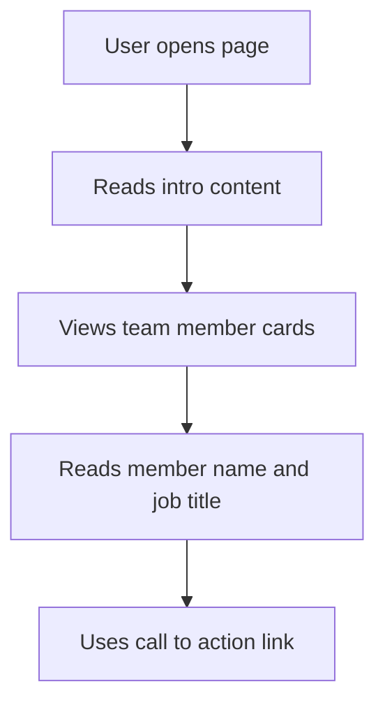

## 1. Product Overview
Create a beginner-friendly "Meet the Team" section that matches the provided challenge assets and teaches grid, responsive layout, and overlay positioning.
- The page helps learners practice semantic HTML and CSS while building a clean team showcase.
- The value of the project is a simple, teachable example that looks polished without relying on frameworks or complex effects.

## 2. Core Features

### 2.1 Feature Module
1. **Meet the Team Page**: intro content, responsive team grid, member cards, action link

### 2.2 Page Details
| Page Name | Module Name | Feature description |
|-----------|-------------|---------------------|
| Meet the Team Page | Intro block | Shows small label, heading, and short supporting paragraph |
| Meet the Team Page | Team grid | Uses CSS Grid to place 5 cards in a responsive layout |
| Meet the Team Page | Member card | Displays member image, name, and job title with text overlay |
| Meet the Team Page | Action link | Provides a simple "See all members" call to action |

## 3. Core Process
The user opens the page, reads the short introduction, scans the team cards, and can use the action link as a visual CTA. On smaller screens, the layout stacks into fewer columns while keeping the member content easy to read.

## 4. User Interface Design
### 4.1 Design Style
- Primary colors: soft off-white background, dark text, muted gray body text
- Accent colors: warm beige and dark overlay for card captions
- Button/link style: simple text link with subtle arrow icon and hover underline
- Font and sizes: clean sans-serif stack with clear heading, body, and caption hierarchy
- Layout style: desktop-first editorial grid with one text block and five image cards
- Icon style suggestions: small simple arrow icon from provided assets

### 4.2 Page Design Overview
| Page Name | Module Name | UI Elements |
|-----------|-------------|-------------|
| Meet the Team Page | Intro block | Eyebrow label, medium heading, short paragraph, generous spacing |
| Meet the Team Page | Team grid | Uneven but readable grid with responsive gaps and balanced alignment |
| Meet the Team Page | Member card | Rounded card corners, overflow hidden, image cover, gradient overlay, positioned caption |
| Meet the Team Page | CTA link | Inline link with arrow icon and visible focus state |

### 4.3 Responsiveness
- Desktop-first layout
- Tablet layout reduces the number of columns and keeps card proportions consistent
- Mobile layout stacks content into a single-column flow with readable spacing
- Focus states and text contrast remain clear across screen sizes
