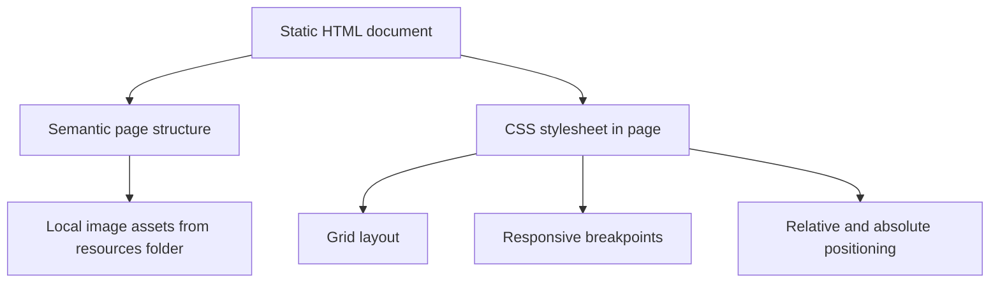

## 1. Architecture Design

## 2. Technology Description

* Frontend: HTML5 + CSS3

* Assets: Local images and icons from the `resources` folder

* Build/Runtime: No framework or bundler required for the final solution

## 3. Route Definitions

| Route | Purpose                                           |
| ----- | ------------------------------------------------- |
| /     | Displays the meet the team section challenge page |

## 4. Implementation Notes

* Use semantic elements such as `main`, `section`, `header`, `article`, and `figure`

* Use a single CSS Grid container for the overall composition

* Use `position: relative` on cards and `position: absolute` for the name/title overlay

* Use the provided linear gradient for readable text over images

* Keep the code beginner-friendly by avoiding preprocessors, frameworks, and unnecessary JavaScript

## 5. Asset Strategy

* Use the provided `person_1.png` through `person_5.png` files for the team members

* Use the provided arrow asset for the CTA if it helps match the design

* Prefer the regular image assets first; `@2x` assets can be used if needed for sharper rendering

## 6. Responsive Strategy

* Desktop: multi-column editorial grid with intro content and cards visible together

* Tablet: fewer columns with simplified placement rules

* Mobile: single-column stack with consistent spacing and full-width cards

* Use fluid spacing with a constrained page width for readability

